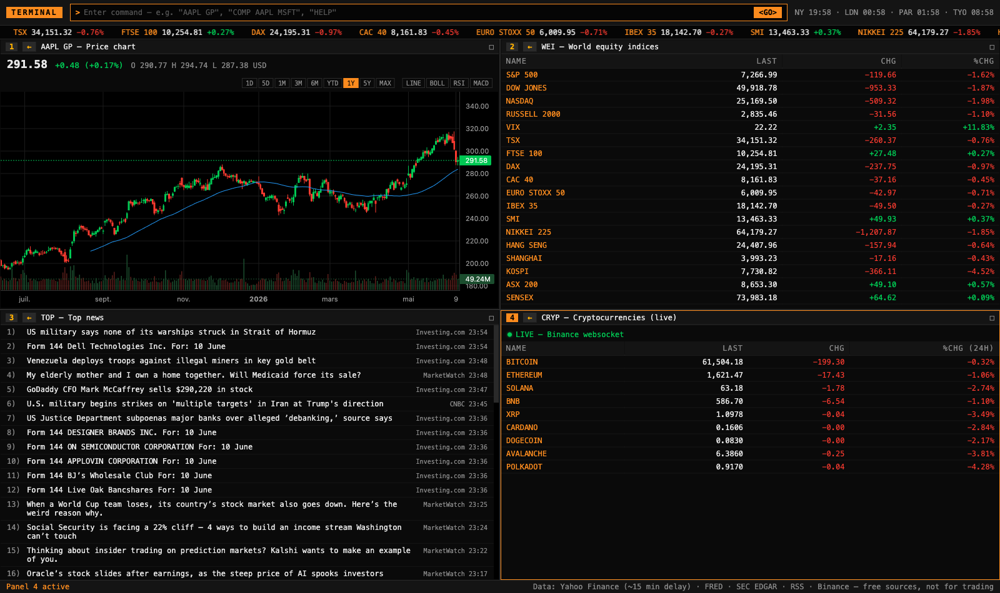

# TERMINAL — clone gratuit du Bloomberg Terminal

Un terminal financier inspiré du Bloomberg Terminal, construit **uniquement avec des sources de données gratuites**. Pas de clé API, pas d'abonnement, pas de compte à créer.



---

## 🚀 Lancer le terminal

**Le plus simple** : double-clique sur **`Lancer TERMINAL.command`** dans le Finder. Ça démarre tout et ouvre le navigateur automatiquement. Pour arrêter : ferme la fenêtre Terminal qui s'est ouverte.

En ligne de commande : `./start.sh`

<details>
<summary>Lancement manuel / première installation</summary>

```bash
# première fois seulement
python3 -m venv backend/.venv
backend/.venv/bin/pip install -r backend/requirements.txt
cd frontend && npm install && cd ..

# à chaque fois (ou utiliser ./start.sh)
cd backend && .venv/bin/uvicorn main:app --port 8000    # terminal 1
cd frontend && npm run dev                               # terminal 2
# → http://localhost:5173
```
</details>

---

## ⌨️ Utilisation

Le terminal s'utilise comme le vrai Bloomberg : **une ligne de commande en haut**, et **4 panneaux** indépendants.

- Tape une commande puis **Entrée** (= le bouton `<GO>` de Bloomberg)
- La commande s'applique au **panneau actif** (bordure orange) — clique sur un panneau pour l'activer
- **Double-clic** sur l'en-tête d'un panneau = plein écran (re-double-clic pour revenir)
- **←** dans l'en-tête (ou taper `BACK` / `MENU`) = revenir à la vue précédente du panneau
- Un **ticker seul** (ex. `TSLA`) recharge la fonction courante avec ce ticker
- Une fonction seule (ex. `FA`) hérite du ticker du panneau actif
- Cliquer sur une ligne dans une liste (indices, crypto, screener, watchlist…) ouvre son graphique

### Toutes les commandes

| Commande | Fonction Bloomberg équivalente | Description |
|---|---|---|
| `AAPL GP` | GP | Graphique bougies/ligne, volumes, SMA 50, plages 1D→MAX + indicateurs **BOLL / RSI / MACD** |
| `AAPL GIP` | GIP | Graphique intraday (journée en bougies 5 min) |
| `COMP AAPL MSFT GOOG` | COMP | Comparaison de performances normalisées en % (jusqu'à 7 titres) |
| `AAPL DES` | DES | Fiche société : activité, secteur, ratios clés, management, objectif analystes |
| `AAPL FA` | FA | États financiers : compte de résultat, bilan, cash flow (annuel / trimestriel) |
| `AAPL Q` | Q | Tableau de cotation grand format |
| `AAPL N` | CN | News du titre |
| `AAPL FIL` | CF | Filings SEC EDGAR : 10-K, 10-Q, 8-K… (titres US uniquement) |
| `TOP` | TOP | Fil de news marchés agrégé |
| `WEI` | WEI | Indices mondiaux (Amériques, Europe, Asie) |
| `FXC` | FXC | Principales paires de devises |
| `CRYP` | — | Cryptomonnaies en **temps réel** (websocket Binance) |
| `CMDTY` | GLCO | Matières premières (métaux, énergie, agri) |
| `EQS` | EQS / MOST | Screener : plus fortes hausses / baisses / volumes du jour |
| `ECO` | ECO / ECST | Indicateurs macro — onglets **EUROPE** (inflation HICP, taux BCE, chômage, PIB, 10 ans DE/FR/BE/IT) et **US** (CPI, taux Fed, courbe des taux…) |
| `CAL` | EVTS / ERN | Prochains résultats (+ estimations EPS/CA) et ex-dividendes de ta watchlist |
| `W` | W | Watchlist personnalisée |
| `PORT` | PORT | Portefeuille : valeur, P&L du jour et total |
| `ALRT` | ALRT | Alertes de prix avec notifications navigateur |
| `BACK` / `MENU` | MENU | Retour à la vue précédente du panneau |
| `HELP` | HELP | Liste des commandes dans le terminal |

Les tickers utilisent la notation Yahoo Finance : `AAPL`, `MC.PA` (Paris), `BMW.DE` (Francfort), `^GSPC` (indice), `EURUSD=X` (devise), `BTC-USD` (crypto), `GC=F` (future or).

---

## ⚙️ Comment ça marche

### Architecture

```
┌────────────────────┐     HTTP      ┌────────────────────┐         ┌──────────────────┐
│  FRONTEND          │  ──────────▶  │  BACKEND           │  ─────▶ │  Yahoo Finance    │
│  React + Vite (TS) │   /api/...    │  FastAPI (Python)  │  ─────▶ │  FRED (St. Louis) │
│  localhost:5173    │               │  localhost:8000    │  ─────▶ │  SEC EDGAR        │
│                    │               │  + cache TTL       │  ─────▶ │  Flux RSS         │
└────────┬───────────┘               └────────────────────┘         └──────────────────┘
         │ websocket direct (crypto temps réel)
         ▼
   Binance (wss://stream.binance.com)
```

**Le backend** (`backend/main.py`, ~500 lignes) est un *agrégateur* : il ne stocke rien en base, il interroge les sources gratuites, normalise les réponses en JSON propre, et garde un **cache en mémoire** pour ne pas marteler les sources (et éviter de se faire limiter par Yahoo). Durées de cache : cotations 30 s, tableaux de marché 45 s, news 5 min, fondamentaux/profils 1 h, macro FRED 1 h, mapping SEC 24 h.

**Le frontend** (`frontend/src/`) gère les 4 panneaux, le parseur de commandes (`commands.ts`), et les graphiques avec **TradingView Lightweight Charts** (la bibliothèque open source de TradingView). Les indicateurs techniques (SMA, Bollinger, RSI, MACD) sont **calculés côté client** (`indicators.ts`) à partir des données brutes.

**Tes données personnelles** (watchlist, portefeuille, alertes, disposition des panneaux) sont stockées dans le **localStorage de ton navigateur** — rien ne quitte ta machine, il n'y a aucun serveur distant.

### D'où vient chaque donnée

| Donnée | Source | Comment | Fraîcheur |
|---|---|---|---|
| Cotations, historiques, graphiques | **Yahoo Finance** (via la lib `yfinance`) | API non officielle de Yahoo | ~15 min de délai |
| Fondamentaux, états financiers, profils | **Yahoo Finance** | idem | mise à jour à chaque publication |
| Screener (gainers/losers/actifs) | **Yahoo Finance** | screeners prédéfinis Yahoo | ~15 min |
| Calendrier résultats/dividendes | **Yahoo Finance** | par ticker | quotidien |
| Macro US (CPI, taux, chômage…) | **FRED** — Federal Reserve Bank of St. Louis | export CSV public, sans clé API | à chaque publication officielle |
| Macro zone euro (HICP, taux BCE, PIB…) | **ECB Data Portal** — Banque centrale européenne | API SDMX publique (CSV), sans clé API | à chaque publication officielle |
| Filings réglementaires | **SEC EDGAR** | API JSON officielle et gratuite de la SEC | temps réel (dépôts officiels) |
| News marchés (`TOP`) | **Flux RSS** : CNBC, MarketWatch, Yahoo, Investing.com | agrégés et triés par date | ~5 min |
| Crypto (`CRYP`) | **Binance** | websocket public, connexion directe depuis ton navigateur | **temps réel** (la seule donnée vraiment live) |

### Les limites par rapport au vrai Bloomberg

Soyons honnêtes sur ce qu'un terminal à 0 €/mois ne peut pas faire face à un terminal à ~30 000 $/an :

- **Pas de temps réel sur les actions** : Yahoo fournit les cours avec ~15 minutes de délai. Le vrai temps réel coûte cher (licences des bourses). Exception : la crypto, vraiment temps réel via Binance.
- **Pas d'obligataire ni de crédit** : les prix des obligations, CDS, et le marché monétaire sont le vrai monopole de Bloomberg — il n'existe aucune source gratuite sérieuse.
- **Pas de chat IB** : la messagerie entre professionnels est *le* produit Bloomberg, irremplaçable par nature.
- **Profondeur limitée** : ~4-5 ans d'états financiers (Bloomberg en a 30+), estimations d'analystes réduites au consensus Yahoo, pas de transcripts d'earnings calls, pas de données alternatives.
- **Screener basique** : 3 listes prédéfinies, pas de requêtes multicritères à la EQS.
- **Fiabilité best-effort** : l'API Yahoo n'est pas officielle ; elle peut changer ou limiter les requêtes sans préavis. La lib `yfinance` est très maintenue et suit ces changements, mais une mise à jour (`pip install -U yfinance`) peut être nécessaire un jour.
- **Usage informatif uniquement** : ne pas trader sur ces données. Usage personnel (les conditions Yahoo interdisent l'usage commercial).

### Structure du code

```
├── Lancer TERMINAL.command   # lanceur double-cliquable (macOS)
├── start.sh                  # démarre backend + frontend + navigateur
├── backend/
│   ├── main.py               # toute l'API (FastAPI) : endpoints + cache + sources
│   └── requirements.txt
└── frontend/src/
    ├── App.tsx               # layout, ligne de commande, panneaux, moteur d'alertes
    ├── commands.ts           # parseur des commandes Bloomberg
    ├── indicators.ts         # SMA, Bollinger, RSI, MACD (calcul client)
    ├── api.ts / hooks.ts     # fetch + polling + localStorage
    ├── Panel.tsx / Tape.tsx  # cadre de panneau / bandeau défilant
    └── views/                # une vue par fonction (Gp, Des, Fa, Eqs, Eco, …)
```

---

## 🛠 Stack

**Backend** : Python · FastAPI · yfinance · feedparser — **Frontend** : React 19 · TypeScript · Vite · TradingView Lightweight Charts v5

Projet construit avec [Claude Code](https://claude.com/claude-code).
